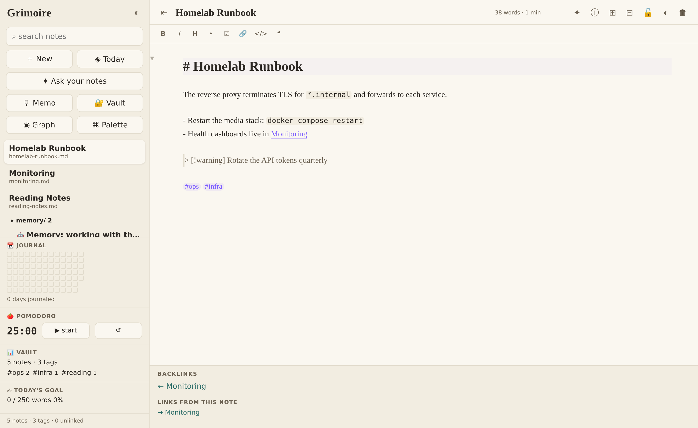
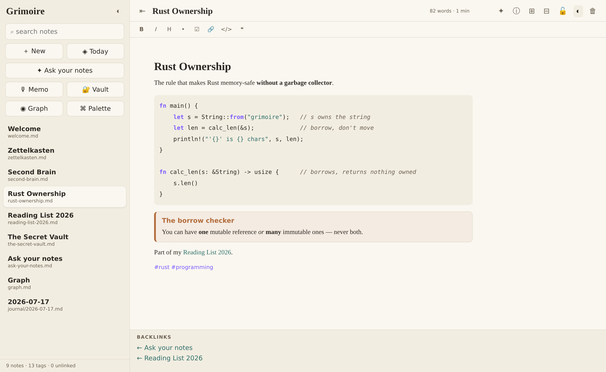
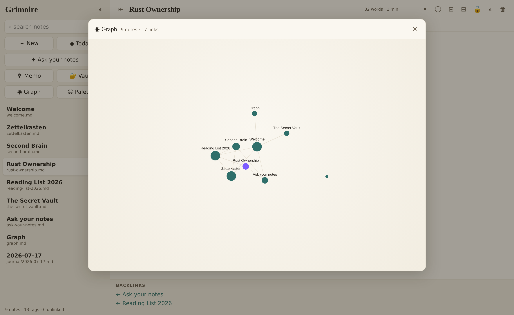
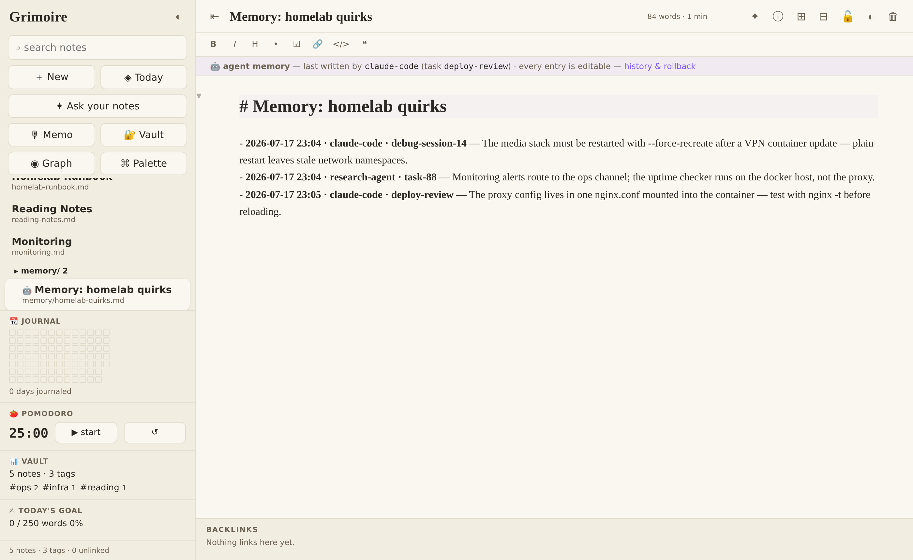
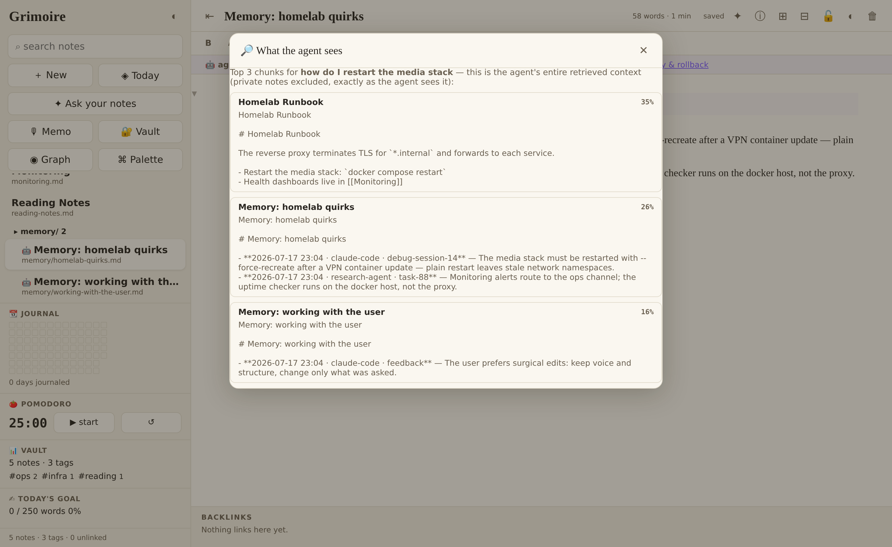
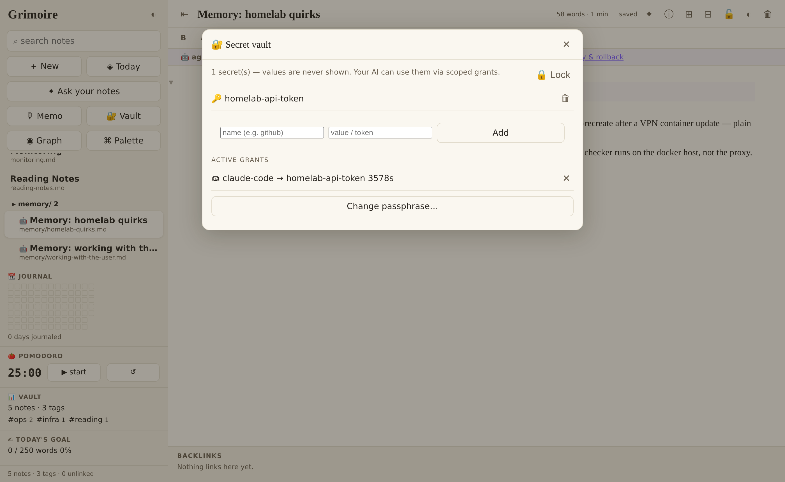

<div align="center">

# ✦ Grimoire

**A personal context server.** Your knowledge base, retrieval, credentials, and
your agents' memory — one self-hosted substrate, one trust boundary, mounted by
your AI over MCP. With a first-class notes app as the human console.

<!-- badges -->


[](benchmarks/locomo/)
[](benchmarks/longmemeval/)



</div>

Your agents already need four things from you: what you know, a way to search
it, credentials to act for you, and somewhere to keep what *they* learn. Today
those live in four disconnected tools — or worse, pasted into prompts. Grimoire
is the single self-hosted server an agent mounts to get all four:

```
          ┌──────────────────── one trust boundary ────────────────────┐
agent ──MCP──►  knowledge (your markdown)  retrieval (RAG + citations) │
          │     credentials (USE, never READ)  agent memory (auditable)│
          └────────────────────────────────────────────────────────────┘
                   the same policy layer decides what an agent
                   can READ and what it can DO
```

- **Knowledge** — plain markdown files you own. **Mount your existing vault**
  (any folder of `.md`, including one another notes app manages) — no migration;
  the watcher reconciles external edits live.
- **Retrieval** — `ask`/`search` over MCP with citations; fully local (Ollama or
  a deterministic offline fallback). Always auditable: *"what would the agent
  see for X?"* shows the exact retrieved chunks.
- **Credentials** — an encrypted vault (Argon2id + Fernet) whose secrets your
  agent can **use but never read**: you mint a scoped, time-boxed grant; the
  server injects the value into the outbound call; every use is audited.
- **Agent memory** — `remember`/`recall` tools writing to a `memory/` namespace
  of ordinary notes with provenance (which agent, when, from what task). You
  read, edit, diff, and **roll back** your agent's memory like any note.

Nothing else puts these in one trust boundary: memory layers (Mem0, Letta, Zep)
have no knowledge base or credentials; notes-RAG tools (Khoj, editor plugins)
have no agent memory or secrets; token vaults (Auth0 GenAI, Arcade, Infisical)
have no knowledge layer. Grimoire is the unified, self-hosted version.

**Not wiring up agents yet?** Grimoire is also a full offline notes app in its
own right — CodeMirror live preview, wiki-links, backlinks, graph, daily notes,
transclusion, canvas. Mount your existing markdown vault with no migration and
daily-drive it; the agent substrate is there when you want it.

## Quick start

```bash
docker compose up -d        # → http://localhost:9111 · notes land in ./vault
```

Mount an **existing** markdown vault instead (editing through Grimoire preserves
foreign frontmatter byte-for-byte — nested YAML and all):

```yaml
# docker-compose.yml
volumes:
  - /path/to/your/vault:/vault
```

<details>
<summary>…or run from source (no Docker)</summary>

```bash
python3 -m venv .venv && .venv/bin/pip install -r requirements.txt
GRIMOIRE_VAULT=~/notes .venv/bin/python -m server      # → http://<host>:9111
```
</details>

**Connect an agent (MCP):** any MCP client can mount Grimoire — Claude Code,
desktop assistants, custom agents. Example config:

```jsonc
// Claude Code's .mcp.json shown; adapt to your client
{ "mcpServers": { "grimoire": {
    "command": "/path/to/grimoire/.venv/bin/python",
    "args": ["-m", "server.mcp_server"],
    "env": { "GRIMOIRE_API": "http://localhost:9111",
             "GRIMOIRE_AGENT_NAME": "my-agent" } } } }
```

The agent gets: `search_notes` · `ask_notes` · `read_note` · `create_note` ·
`update_note` · `append_daily` · `backlinks` · `list_tags` · **`remember`** ·
**`recall`** · **`use_credential`** · **`list_grants`**.

> **Headless agents:** non-interactive runs often skip untrusted project-level
> MCP configs silently — register the server at user scope (or pass your CLI's
> explicit MCP-config flag) and have the agent call `kb_info` once to verify the
> mount. A silently missing mount looks identical to "no knowledge exists."

> **Make agents actually use it:** mounted tools are necessary, not sufficient —
> agents reliably read a repo's context file, and only sometimes browse tool
> lists. Run `grimoire agent-setup` to print the MCP config **plus a
> CLAUDE.md/AGENTS.md snippet** that tells agents to call `get_briefing` first
> and consult the KB before assuming project facts.

**The 60-second demo:** ask your agent to research something → it `ask`s your
notes (you can inspect exactly what it retrieved) → it calls an API with
`use_credential` (the key never enters its context) → it `remember`s what it
learned → you open `memory/` in the console, read the note it wrote, edit one
line, roll back another. That loop is the product.

## The human console

A substrate needs a place where the human reads, reviews, and decides — so
Grimoire ships a full offline-PWA notes app on the same API:

| Rendered markdown | Graph view |
|---|---|
|  |  |

- **Trust surfaces** (the console's real job):

| Agent-memory review | Retrieval inspection |
|---|---|
|  |  |
| Memory notes badged 🤖 with provenance (which agent, which task) — edit or roll back any entry. | "What would the agent see for X?" — the exact ranked chunks, nothing hidden. |

<div align="center">

<br><sub>The credential console: secrets your agent can use but never read — scoped, time-boxed, revocable.</sub>
</div>
- **Editing** — CodeMirror 6 live preview (markup revealed only where you're
  editing), slash commands, `[[` autocomplete, classic plain-text mode, offline
  drafts. Wiki-links, backlinks + outgoing links, unlinked mentions, hover
  previews, tags, graph, daily notes + calendar, live ```` ```query ```` blocks,
  transclusion, footnotes, version history, folder tree, canvas, slides.
- **Plugins** — seven first-party: on-topic ones on by default (KaTeX, Mermaid,
  kanban, vault stats); optional widgets one toggle away (pomodoro, journal
  heatmap, word goal) + an in-app scaffold. [docs/PLUGINS.md](docs/PLUGINS.md)
- Encryption-at-rest for private notes, e-ink `/read` surface, HTML export,
  CRDT-merged multi-device sync, trash + undo, CLI.

## Config

Everything is environment-driven (same variables bare-metal, systemd, Docker):

| Variable | Default | What it does |
|----------|---------|--------------|
| `GRIMOIRE_VAULT` | `~/grimoire-vault` | The folder of `.md` files — your data |
| `GRIMOIRE_PORT` / `GRIMOIRE_HOST` | `9111` / `0.0.0.0` | Bind address |
| `GRIMOIRE_AUTH_TOKEN` | *(empty = open)* | Bearer token for the API/console |
| `GRIMOIRE_AGENT_NAME` | `agent` | Memory attribution for an MCP client |
| `GRIMOIRE_OLLAMA_URL` | *(empty)* | Reachable Ollama → generative ask/summarize |
| `GRIMOIRE_LLM` / `GRIMOIRE_LLM_MODEL` | auto / `qwen3.5:4b` | Answer backend (`ollama` · `claude` · `openai`) + model |
| `GRIMOIRE_LLM_BASE_URL` / `_API_KEY` | *(empty)* | Any OpenAI-compatible endpoint (OpenAI, OpenRouter, Together, Groq, vLLM, LM Studio, LiteLLM…); key can also live in the vault as `llm-api-key` |
| `GRIMOIRE_EMBED_MODEL` | `nomic-embed-text` | Embeddings (offline hashing fallback built in) |
| `GRIMOIRE_LOCAL_EMBED` / `_MODEL` | `auto` / `potion-base-8M` | `pip install model2vec` → local semantic embeddings, no service |
| `GRIMOIRE_WHISPER_URL` / `_MODEL` | *(empty)* | Audio-memo transcription |
| `GRIMOIRE_DAILY_DIR` / `GRIMOIRE_INBOX_DIR` | `journal` / `inbox` | Vault sub-folders |
| `GRIMOIRE_SYNC_PEER` / `_TOKEN` / `_INTERVAL` | *(off)* | Background sync with a peer |
| `GRIMOIRE_VAULT_IDLE_LOCK` | `900` | Credential-vault auto-lock (seconds) |
| `GRIMOIRE_BROKER_ALLOW_PRIVATE` | `0` | Allow brokered calls to private-range hosts |
| `GRIMOIRE_FRAME_OPTIONS` | `SAMEORIGIN` | X-Frame-Options (reverse-proxy embedding) |
| `GRIMOIRE_NO_WATCHER` | `0` | Disable the filesystem watcher (tests/CI) |

AI/model settings can also be changed live in ⚙ Settings (persisted in the
vault, no restart). Editor mode (live/classic) and theme are per-device.

## Security posture (short version)

Secrets sealed with Argon2id + Fernet, key in memory only, brute-force lockout,
idle auto-lock, passphrase rotation. Broker: origin-exact + path-prefix scopes,
SSRF-guarded, fully audited; secret values never appear in any response. Private
notes excluded from retrieval, `/read`, export, transclusion, and queries on
unauthenticated surfaces. Strict CSP. Full threat model: [SECURITY.md](SECURITY.md).

## Benchmarks

Grimoire's retrieval is measured on the two public long-conversation memory
benchmarks the agent-memory field uses — [LoCoMo](https://github.com/snap-research/locomo)
(ACL 2024) and [LongMemEval](https://github.com/xiaowu0162/LongMemEval)
(ICLR 2025) — under pre-registered protocols with all baselines run under
identical conditions: stratified question samples, conversations ingested as
plain session notes, questions asked verbatim against the same retrieval
code the MCP tools serve, fixed reader (`claude-haiku-4-5`), strict blind
LLM judge (`claude-sonnet-5`).

**LoCoMo** (500 questions, ~24k-token conversations):

| context given to the reader | accuracy | context tokens / question |
|---|---|---|
| nothing | 1.2% | 0 |
| grimoire retrieval, zero-dependency default | 76.8% | ~6.2k |
| grimoire retrieval + `pip install model2vec` | 80.8% | ~6.1k |
| grimoire retrieval + nomic-embed (Ollama) | **81.6%** | ~6.2k |
| entire conversation in context | 82.2% | ~24k |

**LongMemEval** (200 questions, ~117k-token haystacks of ~50 chat sessions):

| context given to the reader | accuracy | context tokens / question |
|---|---|---|
| nothing | 6.5% | 0 |
| grimoire retrieval + `pip install model2vec` | **75.0%** | ~5.9k |
| grimoire retrieval + nomic-embed (Ollama) | 73.0% | ~5.8k |
| entire haystack in context | 70.5% | ~117k |

On LoCoMo, retrieval is statistically indistinguishable from stuffing the
whole conversation into context (McNemar p = 0.82 nomic / p = 0.51
model2vec, n = 500) at ~4× fewer tokens. On LongMemEval's much larger
haystacks, retrieval **matches and directionally beats** full context
(p = 0.26) at ~20× fewer tokens — long-context needle-finding degrades
where focused retrieval doesn't, especially on temporal reasoning (81.5%
vs 68.5%). Full methods, per-category tables, per-question raw data, and
the honest failure notes: [benchmarks/locomo/](benchmarks/locomo/) ·
[benchmarks/longmemeval/](benchmarks/longmemeval/).

## Tests

```bash
.venv/bin/pytest              # hermetic: unit + api + negative + integration + e2e
verify run .verify.yaml       # live api + headless-browser smoke (isolated port)
```

## Layout

```
server/                    FastAPI substrate: SQLite(FTS5) index over plain markdown
server/mcp_server.py       the agent interface (knowledge · memory · credentials)
server/routers/memory.py   agent-memory namespace w/ provenance
server/crypto.py           credential vault (Argon2id + Fernet) + broker
server/crdt.py             sequence CRDT for concurrent-edit merges
web/                       the human console (offline PWA, no build step)
plugins/                   first-party console plugins
cli/grimoire.py            scriptable CLI
docs/                      ARCHITECTURE · PLUGINS
```

**More docs:** [ARCHITECTURE](docs/ARCHITECTURE.md) ·
[PLUGINS](docs/PLUGINS.md) · [SECURITY](SECURITY.md) · [CONTRIBUTING](CONTRIBUTING.md)

---

<div align="center">
<sub>MIT licensed · self-hosted · one trust boundary for you and your agents.</sub>
</div>
