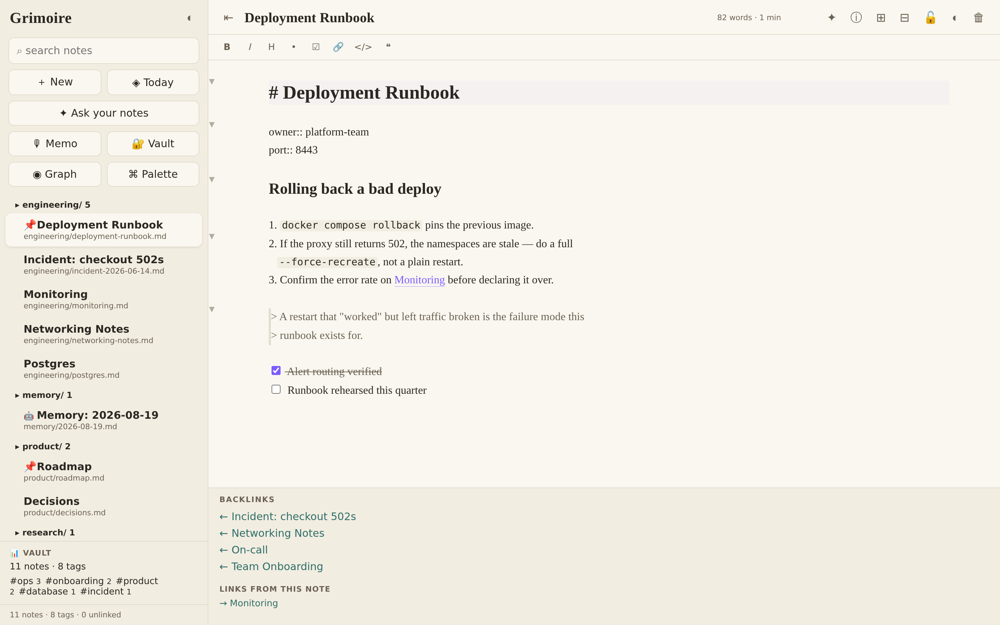
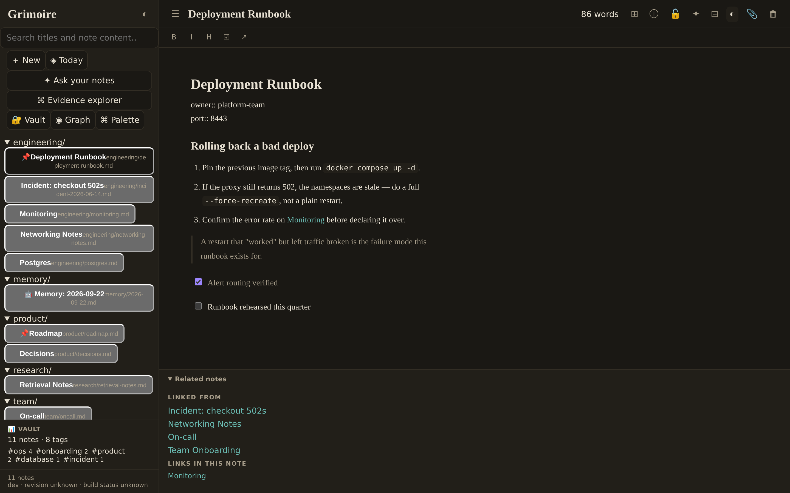
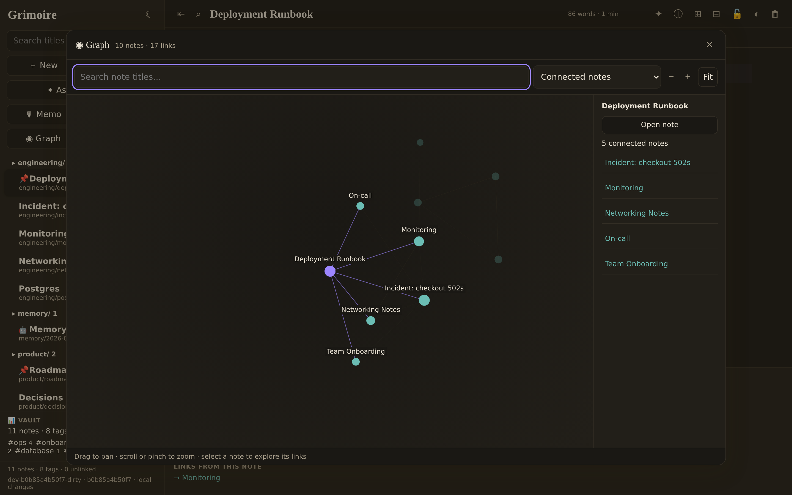
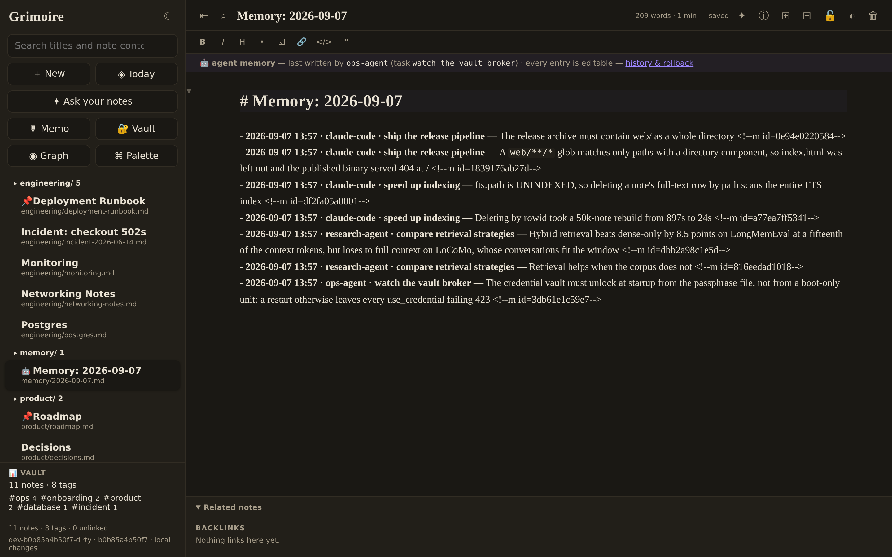
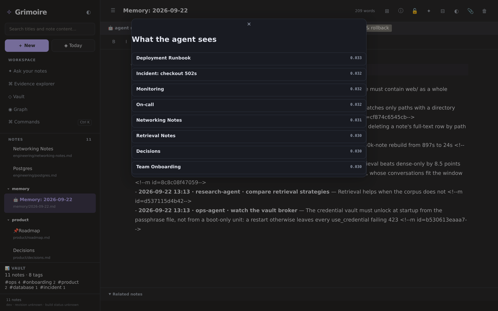
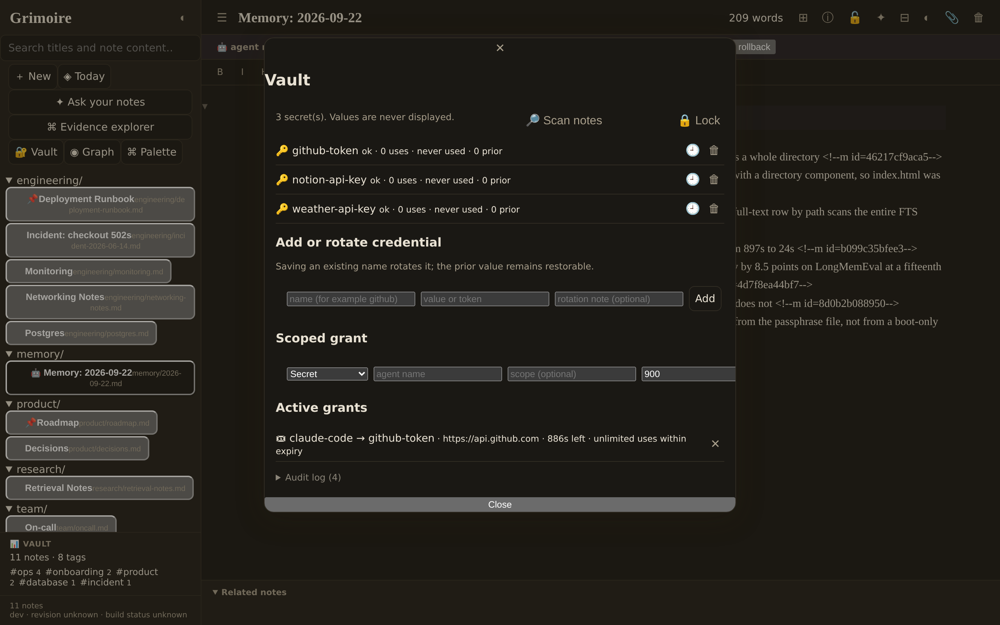

<div align="center">

# ✦ Grimoire

**A self-hosted personal context server** — one knowledge and trust boundary
shared by you and your AI agents. Your knowledge base, retrieval, credentials,
and your agents' memory, mounted over MCP. With a first-class notes app as the
human console.

<!-- badges -->
[](https://github.com/JeremiahM37/grimoire/actions/workflows/ci.yml)


[](benchmarks/locomo/)
[](benchmarks/longmemeval/)



</div>

Your agents already need four things from you: what you know, a way to search
it, credentials to act for you, and somewhere to keep what *they* learn. Today
those live in four disconnected tools — or worse, pasted into prompts. Grimoire
is the single self-hosted server an agent mounts to get all four:

```
          ┌──────────────────── one trust boundary ────────────────────┐
agent ──MCP──►  knowledge (your markdown)  retrieval (RAG + citations) │
          │     credentials (USE, never READ)  agent memory (auditable)│
          └────────────────────────────────────────────────────────────┘
                   the same policy layer decides what an agent
                   can READ and what it can DO
```

- **Knowledge** — plain markdown files you own. **Mount your existing vault**
  (any folder of `.md`, including one another notes app manages) — no migration;
  the watcher reconciles external edits live.
- **Retrieval** — `ask`/`search` over MCP with citations; fully local (Ollama or
  a deterministic offline fallback). Always auditable: *"what would the agent
  see for X?"* shows the exact retrieved chunks.
- **Credentials** — an encrypted vault (Argon2id + Fernet) whose secrets your
  agent can **use but never read**: you mint a scoped, time-boxed grant, the
  server injects the value into the outbound call, and the agent gets the
  response. The key never enters its context, so it cannot be logged,
  memorised, or extracted by a prompt injection — and revoking access is one
  row, not a key rotation. [How it works ↓](#credentials-your-agent-can-use-but-never-read)
- **Agent memory** — `remember`/`recall` tools writing to a `memory/` namespace
  of ordinary notes with provenance (which agent, when, from what task). You
  read, edit, diff, and **roll back** your agent's memory like any note.

None of these four is novel on its own, and the credential half is the least
novel of all: brokering a secret so an agent can use it without holding it is an
established pattern with an [IETF draft](https://datatracker.ietf.org/) and
several implementations — Auth0's Token Vault, agentgateway, Arcade. What is
unusual is the **combination**, in one process, under one policy: memory layers
(Mem0, Letta, Zep) carry no knowledge base or credentials; notes-RAG tools
(Khoj, editor plugins) carry no agent memory or secrets; token vaults carry no
knowledge layer. Grimoire is the self-hosted version of all four at once, on
files you own — which is a claim about integration, not invention.

**Not wiring up agents yet?** Grimoire is also a full offline notes app in its
own right — CodeMirror live preview, wiki-links, backlinks, graph, daily notes,
transclusion, canvas. Mount your existing markdown vault with no migration and
daily-drive it; the agent substrate is there when you want it.

## Quick start

```bash
# a released binary — no runtime, no virtualenv, nothing to install alongside it
curl -sSL https://github.com/JeremiahM37/grimoire/releases/latest/download/grimoire_linux_amd64.tar.gz | tar xz
GRIMOIRE_VAULT=~/notes ./grimoire            # → http://localhost:9111

# or a container
docker run -p 9111:9111 -v grimoire-vault:/vault ghcr.io/jeremiahm37/grimoire:latest

# or from source
go install github.com/JeremiahM37/grimoire/go/cmd/grimoire@latest
```

Releases ship both binaries — `grimoire` (server + CLI) and `grimoire-mcp` (the
agent interface) — for Linux, macOS and Windows on amd64 and arm64, with the
console and plugins alongside them. `grimoire version` says which build you have.

Prefer compose? `docker compose up -d` serves the same thing with notes in
`./vault`.

Already have a pile of markdown? Skip the empty-vault cold start:

```bash
grimoire ingest ~/obsidian-vault    # bulk-import a folder of markdown/text
grimoire seed-demo                  # …or write a small sample vault to explore
```

Mount an **existing** markdown vault instead (editing through Grimoire preserves
foreign frontmatter byte-for-byte — nested YAML and all):

```yaml
# docker-compose.yml
volumes:
  - /path/to/your/vault:/vault
```

<details>
<summary>…or run from source (no Docker)</summary>

```bash
cd go && go build -o grimoire ./cmd/grimoire && go build -o grimoire-mcp ./cmd/grimoire-mcp
GRIMOIRE_VAULT=~/notes GRIMOIRE_WEB_DIR=../web ./grimoire   # → http://<host>:9111
```

One static binary, no runtime, no virtualenv. The same binary is the CLI:
`grimoire capture "a thought"`, `grimoire search deploy`, `grimoire ingest
~/old-notes`, `grimoire export --out site/` — run `grimoire help` for the list.
</details>

**Connect an agent (MCP):** any MCP client can mount Grimoire — Claude Code,
desktop assistants, custom agents. Example config:

```jsonc
// Claude Code's .mcp.json shown; adapt to your client
{ "mcpServers": { "grimoire": {
    "command": "/path/to/grimoire/go/grimoire-mcp",
    "env": { "GRIMOIRE_API": "http://localhost:9111",
             "GRIMOIRE_AGENT_NAME": "my-agent" } } } }
```

The agent gets, in one mount:

<!-- tools:begin (checked against the server by a test) -->

| | tools |
|---|---|
| **Credentials — use, never read** | **`use_credential`** · **`list_grants`** |
| **Agent memory** | **`remember`** · **`recall`** · **`consolidate_memory`** |
| Knowledge | `search_notes` · `ask_notes` · `read_note` · `list_notes` · `backlinks` · `list_tags` |
| The web | `search_web` · `open_urls` |
| Writing | `create_note` · `update_note` · `append_daily` |
| Exact values | `get_fact` · **`set_fact`** |
| Orientation | `get_briefing` · `kb_info` |

<!-- tools:end -->

(That table is checked against the running server by a test, so it cannot drift
out of date.)

`ask_notes` decomposes multi-hop questions and LLM-reranks the evidence when a
model is configured. `consolidate_memory` compacts the `memory/` namespace
(merge redundant entries, supersede stale ones) so recall stays sharp as it
grows — snapshotted first, so every rewrite is reviewable and roll-back-able.

**Structured facts** — for values that must be *exact* (a port, a version, an
owner, a decision), prose RAG is the wrong tool. Write `key:: value` inline in
any note and agents can look it up deterministically via `get_fact` — no
paraphrase, no hallucination. It's still plain markdown you read and edit; the
facts table is just a projection of it, exactly like tags and backlinks.

The MCP server speaks **stdio** by default (local desktop agents). For web or
remote clients (Open WebUI, hosted), run it over **streamable-HTTP** with no
proxy — `GRIMOIRE_MCP_TRANSPORT=http ./grimoire-mcp` serves at
`http://127.0.0.1:9112/mcp` (localhost-bound; front it with your reverse proxy
+ auth before exposing it).

> **Headless agents:** non-interactive runs often skip untrusted project-level
> MCP configs silently — register the server at user scope (or pass your CLI's
> explicit MCP-config flag) and have the agent call `kb_info` once to verify the
> mount. A silently missing mount looks identical to "no knowledge exists."

> **Make agents actually use it:** mounted tools are necessary, not sufficient —
> agents reliably read a repo's context file, and only sometimes browse tool
> lists. Run `grimoire agent-setup` to print the MCP config **plus a
> CLAUDE.md/AGENTS.md snippet** that tells agents to call `get_briefing` first
> and consult the KB before assuming project facts.

## Credentials your agent can use but never read

Giving an agent an API key means the key is in its context — and therefore in
the transcript, the logs, and whatever the model provider retains. Revoking it
means rotating the key everywhere. Grimoire's answer is to never hand it over:

```
you                     grimoire                          the API
 │  mint a grant ───────►│
 │  (secret, origin,     │
 │   TTL, grantee)       │
                         │
agent ── use_credential ►│── injects the secret ──────────►│
        (grant, url)     │                                 │
        ◄── response ────│◄────────────────────────────────│
        (never the key)  │  writes an audit row
```

The agent holds a **grant** — a random token bound to one secret, one origin,
a path prefix and an expiry — not the credential. It names a URL; Grimoire
makes the call with the secret injected into a header and returns the
**response**. The value never enters the agent's context, so it cannot be
logged, memorised, or exfiltrated by a prompt injection, and revoking a grant
is one row, not a key rotation.

```bash
# you, once, at the console (requires the vault unlocked)
curl -X POST localhost:9111/api/secrets -d '{"name":"gh","value":"ghp_..."}'
curl -X POST localhost:9111/api/secrets/gh/grant \
     -d '{"grantee":"research-agent","scope":"https://api.github.com/repos","ttl_seconds":3600}'
# → {"grant":"kQ7…","expires_in":3600}   ← the grant is what the agent gets

# the agent, over MCP: use_credential{token, url, method, header}
# → the JSON the API returned. Never "ghp_...".
```

What the boundary actually enforces — each of these is a test, and the
reasoning is in [SECURITY.md](SECURITY.md):

| control | why it exists |
|---|---|
| **origin-exact scope** | a grant for `https://api.github.com` does **not** authorize `https://api.github.com.evil.example`; scheme, host and port must match and the path prefix is compared on whole segments, so `/v1` does not authorize `/v10` |
| **redirect re-check** | Go strips `Authorization` across hosts, but the broker injects whatever header you named — an `X-Api-Key` would otherwise follow a 302 to an attacker |
| **SSRF guard at connect time** | the address the socket is about to use is checked, not a hostname resolved earlier, so DNS rebinding does not defeat it; cloud-metadata and link-local are refused even with `GRIMOIRE_BROKER_ALLOW_PRIVATE=1` |
| **unlocked vault required** | a leaked grant token alone brokers nothing |
| **expiry + revocation** | grants are time-boxed, listable (`list_grants`) and individually revocable; there is also a revoke-all |
| **append-only audit** | every grant and every brokered call is recorded — secret name, grantee, URL, status — and never the value |

The console shows the same thing to the human: which agent holds what, against
which origin, for how long, and what it has done with it.

**The 60-second demo:** ask your agent to research something → it `ask`s your
notes (you can inspect exactly what it retrieved) → it calls an API with
`use_credential` (the key never enters its context) → it `remember`s what it
learned → you open `memory/` in the console, read the note it wrote, edit one
line, roll back another. That loop is the product.

## The human console

A substrate needs a place where the human reads, reviews, and decides — so
Grimoire ships a full offline-PWA notes app on the same API:

| Rendered markdown | Graph view |
|---|---|
|  |  |

- **Trust surfaces** (the console's real job):

| Agent-memory review | Retrieval inspection |
|---|---|
|  |  |
| Memory notes badged 🤖 with provenance (which agent, which task) — edit or roll back any entry. | "What would the agent see for X?" — the exact ranked chunks, nothing hidden. |

<div align="center">

<br><sub>The credential console: secrets your agent can use but never read — scoped, time-boxed, revocable.</sub>
</div>
- **Editing** — CodeMirror 6 live preview (markup revealed only where you're
  editing), slash commands, `[[` autocomplete, classic plain-text mode, offline
  drafts. Wiki-links, backlinks + outgoing links, unlinked mentions, hover
  previews, tags, graph, daily notes + calendar, live ```` ```query ```` blocks,
  transclusion, footnotes, version history, folder tree, canvas, slides.
- **Plugins** — seven first-party: on-topic ones on by default (KaTeX, Mermaid,
  kanban, vault stats); optional widgets one toggle away (pomodoro, journal
  heatmap, word goal) + an in-app scaffold. [docs/PLUGINS.md](docs/PLUGINS.md)
- Encryption-at-rest for private notes, e-ink `/read` surface, HTML export,
  CRDT-merged multi-device sync, trash + undo, CLI.

## More than one person

Grimoire starts as a single-user server and stays one until you create an
account — that act, not a flag, is what turns multi-user on, because a flag can
be flipped on a running server and lock its owner out of their own notes.

```bash
grimoire user add alice --admin     # the first account; every later one is an admin's doing
grimoire space add Engineering team/eng
grimoire space member team/eng bob --read
```

Access is **spaces**: a subtree of the vault plus the people who may see it.
A note can additionally carry a `readers:` list in its frontmatter, which
*narrows* access within its space — that is how a pulled Slack thread keeps the
channel's membership. It travels in the file, so it survives a reindex and is
visible to whoever opens the note. A
path prefix rather than a per-note access list, because the files outlive the
app — a prefix is visible in the file tree and survives being copied to another
machine, while a per-note ACL lives only in an index that is meant to be
rebuildable from the files alone. Each account gets `users/<name>/`;
administrators create shared prefixes; everything else is the commons, which is
what keeps an existing vault working unchanged.

The filter is applied **inside** ranking, not to its output. BM25 scores against
corpus statistics, so filtering afterwards would leave visible chunks scored
against a corpus that includes notes the caller cannot see — and their contents
would move the ranking. A test floods an unreadable space with the query term
and asserts that not one visible score changes.

Agents authenticate with API keys (`POST /api/keys`, shown once, stored hashed).
Administrators manage accounts, spaces, connectors and the credential vault;
members read and write the spaces they belong to.

### What it costs at size

Measured on synthetic vaults (local embedder, one box), because "scales fine" is
not a claim anyone should take on faith:

| notes | cold index | restart | RSS | query p50 | write (median) | after a write |
|---|---|---|---|---|---|---|
| 1,000 | 0.6s | 0.1s | 93 MB | 1.2 ms | ~1 ms | 1.5 ms |
| 10,000 | 5.0s | 0.1s | 209 MB | 10.5 ms | ~1 ms | 11.2 ms |
| 50,000 | 24.3s | 0.4s | 559 MB | 37.5 ms | 1.4 ms | 42.7 ms |
| 200,000 | 97.5s | ~1.5s | 1.86 GB | 171.7 ms | 5.4 ms | 201.9 ms |

Writes are flat because they cost the note, not the corpus. The FIRST write
after a start is not: it pays once for the link resolver's lookup maps (118ms at
50k, 539ms at 200k), then every write after it is the number above. An earlier
version of this table timed a single write and reported that one-time cost as
the write cost — which is how a measurement lies without anything being wrong
with the code.

Three things had to change to get there, and each was a measured problem rather
than a suspected one:

**Restarts re-derived everything.** Serving began with a full rebuild — every
note re-read, every chunk re-embedded — which is minutes with a remote embedder
and happens again on every crash-loop iteration. A sync now reads only what
changed on disk, and a full rebuild happens only when the embedding model or the
row shape does.

**Every write threw away the retrieval cache**, so the next query rebuilt the
whole corpus: 2.2s at 50,000 notes, paid by whoever asked next. Writes patch the
cache in place instead, and a test asserts a patched cache returns byte-identical
hits to a rebuilt one — the property that keeps the benchmark numbers above
meaningful.

**Indexing was quadratic**, because deleting a note's full-text row scanned the
whole FTS index. 897s → 24s for a 50,000-note rebuild.

What is left is honest to say too: **query cost is linear in corpus size**,
because the dense leg scores every chunk. 200,000 notes is 172ms at p50 and
1.86 GB resident — usable, and the point where the curve starts to matter.
Beyond it the lever is an approximate index (HNSW), which trades recall for
latency; the numbers above are what should decide when to pull it, and they do
not yet.

## Connectors

Most of what a team knows is in Slack, Confluence, Jira, Drive and GitHub, and
none of it is going to be retyped. Connectors pull it in — as **markdown notes
in your vault**, with provenance in the frontmatter, so search, retrieval,
spaces, the editor and device sync work on them for free. You can also read them
with `cat`, and if Grimoire disappears the pulled knowledge is still there.

| source | pulls | credential |
|---|---|---|
| **Slack** | threads (not stray messages) and per-channel daily notes | bot token, `channels:history` |
| **Confluence** | pages by space, converted from storage format | account email + API token |
| **Jira** | issues with description and comments, ADF flattened | account email + API token |
| **Google Drive** | Docs exported as text, plus text/markdown files | OAuth or service-account token |
| **GitHub** | issues and PRs with comments; optionally the repo's markdown | personal access token |
| **RSS / Atom** | any feed — changelogs, status pages, blogs | none |

Configure them in the console (**⌘K → Connectors**) or over the API. Each source
declares its own fields, help text and where to get its credential, so the
console renders a form it does not have hardcoded and a new source needs no
console change. Credentials are named, not stored: the value comes from the
credential vault for one request and never enters the connector row, the API or
a note.

Syncs are incremental — a cursor per connector, a stable id per document — so a
re-sync updates a note rather than duplicating it, and an unchanged document is
not re-embedded. A failure keeps its place and says what to do about it ("the
bot is not a member of that channel"), rather than "unexpected status 403".

## Config

Everything is environment-driven (same variables bare-metal, systemd, Docker):

| Variable | Default | What it does |
|----------|---------|--------------|
| `GRIMOIRE_VAULT` | `~/grimoire-vault` | The folder of `.md` files — your data |
| `GRIMOIRE_PORT` / `GRIMOIRE_HOST` | `9111` / `0.0.0.0` | Bind address |
| `GRIMOIRE_AUTH_TOKEN` | *(empty = open)* | Bearer token for the API/console |
| `GRIMOIRE_AGENT_NAME` | `agent` | Memory attribution for an MCP client |
| `GRIMOIRE_OLLAMA_URL` | *(empty)* | Reachable Ollama → generative ask/summarize |
| `GRIMOIRE_LLM` / `GRIMOIRE_LLM_MODEL` | auto / `qwen3.5:4b` | Answer backend (`ollama` · `claude` · `openai`) + model |
| `GRIMOIRE_LLM_BASE_URL` / `_API_KEY` | *(empty)* | Any OpenAI-compatible endpoint (OpenAI, OpenRouter, Together, Groq, vLLM, LM Studio, LiteLLM…); key can also live in the vault as `llm-api-key` |
| `GRIMOIRE_EMBED_MODEL` | `nomic-embed-text` | Embeddings (offline hashing fallback built in) |
| `GRIMOIRE_LOCAL_EMBED` / `_MODEL` | `auto` / `potion-base-8M` | Local semantic embeddings — the ~30 MB model is fetched once on first start (`grimoire fetch-model` to pre-seed); `off` to stay on the hashing embedder |
| `GRIMOIRE_WHISPER_URL` / `_MODEL` | *(empty)* | Audio-memo transcription |
| `GRIMOIRE_WEB_SEARCH_PROVIDER` | *(off)* | `searxng` · `brave` · `serper` · `google` — enables `search_web` / `open_urls` |
| `GRIMOIRE_WEB_SEARCH_URL` / `_KEY` / `_CX` | *(empty)* | SearXNG base URL · provider key (or `vault:name` to read it from the credential vault) · Google engine id |
| `GRIMOIRE_DAILY_DIR` / `GRIMOIRE_INBOX_DIR` | `journal` / `inbox` | Vault sub-folders |
| `GRIMOIRE_SYNC_PEER` / `_TOKEN` / `_INTERVAL` | *(off)* | Background sync with a peer |
| `GRIMOIRE_VAULT_IDLE_LOCK` | `900` | Credential-vault auto-lock (seconds) |
| `GRIMOIRE_VAULT_PASSPHRASE_FILE` | *(empty)* | Unlock the credential vault at startup from a `0600` file — for a headless server whose agents need the broker after every restart ([trade-off](#security-posture-short-version)) |
| `GRIMOIRE_BROKER_ALLOW_PRIVATE` | `0` | Allow brokered calls to private-range hosts |
| `GRIMOIRE_FRAME_OPTIONS` | `SAMEORIGIN` | X-Frame-Options (reverse-proxy embedding) |
| `GRIMOIRE_TRUST_PROXY` | `0` | Honour `X-Forwarded-For` / `-Proto` — set only when a proxy you control sets them, since they are otherwise caller-supplied |
| `GRIMOIRE_RATE_GENERAL` / `_EXPENSIVE` | `500` / `2` per second | Rate limits (burst = 20×). `GRIMOIRE_RATE_LIMIT=off` disables both |
| `GRIMOIRE_ADMIN_TOKEN` | *(empty)* | Gates the administrative surface — vault, connectors, accounts, settings — while notes and retrieval stay open. For instances that want to answer questions from a trusted network without handing it the levers |
| `GRIMOIRE_METRICS` | *(on)* | `off` removes `/metrics` |
| `GRIMOIRE_MCP_TRANSPORT` | `stdio` | `http` serves MCP over streamable-HTTP instead |
| `GRIMOIRE_MCP_ADDR` / `_PORT` | `127.0.0.1` / `9112` | Bind for the MCP http transport |
| `GRIMOIRE_URL` | `http://127.0.0.1:$PORT` | API the MCP server talks to |
| `GRIMOIRE_PLUGIN_DIR` | `plugins` | Where plugin bundles are loaded from |
| `GRIMOIRE_MODEL_DIR` | *(cache dir)* | Where the local embedding model is stored |
| `GRIMOIRE_EMBED_BASE_URL` / `_API_KEY` | *(empty)* | OpenAI-compatible embeddings endpoint |
| `GRIMOIRE_CONTEXT_BUDGET` | `100000` | Characters under which `ask`/`/api/context` hand over the WHOLE vault instead of retrieving (0 disables) |
| `GRIMOIRE_FOLLOW_SYMLINKS` | `0` | Index through directory symlinks, so a folder of markdown that lives elsewhere is part of the vault without being copied into it |
| `GRIMOIRE_NO_WATCHER` | `0` | Disable the filesystem watcher (tests/CI) |

AI/model settings can also be changed live in ⚙ Settings (persisted in the
vault, no restart). Editor mode (live/classic) and theme are per-device.

## Security posture (short version)

Secrets sealed with Argon2id + Fernet, key in memory only, brute-force lockout,
idle auto-lock, passphrase rotation. Broker: origin-exact + path-prefix scopes,
SSRF-guarded, fully audited; secret values never appear in any response. Private
notes excluded from retrieval, `/read`, export, transclusion, and queries on
unauthenticated surfaces. Strict CSP. Full threat model: [SECURITY.md](SECURITY.md).

Requests are bounded: bodies are capped before a handler reads them, and the
routes that spend someone ELSE's resources — `ask`, `web/*`, a connector run —
have a much tighter rate limit than ordinary reads, because a loop over any of
them is both a denial of service here and a way to get banned by whoever is on
the other end. Login backs off exponentially per account and per source address,
the same reasoning the secret vault has always applied to passphrases.
`X-Forwarded-For` and `X-Forwarded-Proto` are ignored unless
`GRIMOIRE_TRUST_PROXY=1`, because honouring an unverified forwarded address lets
anyone mint a fresh identity per request and walk through every limit.

On a multi-user instance: sessions and API keys are stored hashed, passwords are
Argon2id, access is by space, and administrators can read every space — that is
a deliberate simplification, stated here rather than discovered later, because
the alternative is an administrator who cannot fix a space they cannot see.
Connector credentials are named, never stored by the connector, and never
returned. Web fetching goes through the credential broker's outbound guard,
because the URL comes from whoever is asking.

Reads of **restricted** documents are recorded — allowed and denied alike — with
the account, the path, the route and the address, readable by an administrator
at `GET /api/admin/reads` or on the box with `grimoire audit [--denied]`. A
permission model answers "may they read this" and cannot answer "who did",
which is the question actually asked after a document turns out to have been in
the wrong space for a month. Two limits keep it from becoming surveillance of
ordinary work: only restricted documents are recorded, never a note everyone
can read, and never search — a hit list is a record of what someone was looking
for, which is a more invasive thing than a record of what they opened. Records
are kept 90 days (`GRIMOIRE_READ_AUDIT_DAYS`, `0` keeps everything), because a
permanent list of who read which sensitive document is its own liability.
Nothing is written on a single-user instance, where nothing is restricted.
A denial is recorded for any path, including one that does not exist — walking
paths you cannot open is what the trail should show — so denials are bounded at
120 per actor per minute and counted past that, keeping the signal without
letting a loop over invented paths write rows forever.
An answer counts as a read of what it quotes: the restricted documents an
`/api/ask` answer CITES are recorded, because being shown a document's text is
disclosure whether or not the reader knew it existed. The rest of the retrieval
context is not — in full-corpus mode that is every note, which would be a row
per note per question and no signal at all. Agents are covered without anything
extra: the MCP server is an HTTP client carrying an account's API key, so a
model that opens or is handed a restricted note is recorded as that account, on
that key.

Two options trade a property for availability, so they are off by default and
worth naming here rather than in a footnote:

- **`GRIMOIRE_VAULT_PASSPHRASE_FILE`** replaces "only a human unlocks the vault"
  with "anything running as the service user can". It exists because the
  alternative in practice is worse: a boot-time script POSTing the passphrase to
  `/api/vault/unlock`, which puts it on the HTTP surface and still leaves the
  broker locked after any later restart. The file must not be group- or
  world-readable and the server refuses it if it is.
- **`GRIMOIRE_FOLLOW_SYMLINKS`** turns "anyone who can write to the vault" into
  "anyone who can choose what the server reads". Enable it when you control
  what lands in the vault; leave it off if the vault is fed by a sync client or
  shared with other people.

## What this is not

Stated here rather than discovered later:

- **Source permissions are mirrored, not synced.** Two mechanisms narrow the
  gap. Routing sends a source's own structure to different folders (`route_by` /
  `route_map`: a Confluence space, a Slack channel, a Jira project each into
  their own space). And a document can carry a **reader list**: Slack's
  `mirror_members` restricts each pulled conversation to that channel's members,
  mapped to accounts through an explicit identity table, and a member with no
  mapped account cannot read it — the safe direction. A reader list can only
  narrow: it never grants access to a space you cannot already read.
  What is still missing is the *sync*: if someone's access changes at the
  source, nothing here notices until the next pull, and Confluence and Jira
  restrictions are not read at all yet.
- **Connectors notice deletions only where the source enumerates.** An
  incremental sync asks "what changed since the cursor", and a deleted document
  did not change — it is indistinguishable from an untouched one. A source that
  just listed everything can say otherwise, and RSS does (a feed *is* the
  current list), so a dropped entry's note is removed. Slack, Jira, Confluence,
  Drive and GitHub sync incrementally, so a document deleted there stays in the
  vault until you remove it.
- **Query cost is linear in corpus size** — see the table above. Fine into the
  low hundreds of thousands of chunks on one box; beyond that the answer is an
  approximate index, which trades recall.
- **One process, one SQLite file.** No horizontal scale, no HA. Recovery is
  `grimoire backup` and `grimoire restore` — a plain .tar.gz of the vault, with
  the index left out because a restore rebuilds it and the sealed secret store
  left IN because nothing else can reproduce it. A test does the round trip and
  asserts the restored vault answers a search. But there is no failover: if the
  process is down, it is down.
- **Administrators can read every space.** A deliberate simplification: the
  alternative is an administrator who cannot fix a space they cannot see.
- **Plugins are trusted code, not sandboxed.** A plugin is an ES module the
  console imports with full page privileges, in every user's browser. Installing
  one is equivalent to letting its author act as whoever opens the console, so
  installation is administrators-only and a plugin should be read before it is
  enabled.
- **Sync moves whole notes.** A peer holding the sync token is treated as the
  deployment's own device and gets everything; a person syncing gets what they
  can read. Do not hand the sync token to someone you would not give the vault.
- **No SSO, no SCIM, no audit export.** Accounts are local.

## Watching it run

`/metrics` in Prometheus text format, from what the server already computes —
no collector, no sampling, and the one metric that needs a query (corpus size)
memoized for fifteen seconds so scraping cannot become load:

```
grimoire_requests_total{route="retrieve",status="2xx"}   is it serving, and what fails
grimoire_request_seconds_bucket{route="ask"}             what is slow
grimoire_retrieval_seconds                               is ranking the slow part
grimoire_cache_rebuilds_total / _patches_total           is a write throwing the cache away
grimoire_connector_runs_total{kind="slack",outcome=…}    did the 03:00 sync work
grimoire_login_failures_total / _lockouts_total          is somebody guessing
grimoire_vault_unlocked_info                             can the broker serve at all
grimoire_notes_current · grimoire_cache_chunks_current · _cache_vector_bytes
```

Paths are reduced to a bounded route class and never emitted raw: a note path is
user content, and a label would put note titles into a monitoring system for its
retention period and add one series per note. A test asserts a note path cannot
reach the metrics output.

## Benchmarks

Measured on the two public long-conversation memory benchmarks the agent-memory
field uses — [LoCoMo](https://github.com/snap-research/locomo) (ACL 2024) and
[LongMemEval](https://github.com/xiaowu0162/LongMemEval) (ICLR 2025) — under
pre-registered protocols. Stratified question samples, conversations ingested
as plain session notes, questions asked verbatim against the same retrieval
code the MCP tools serve, fixed reader (`claude-haiku-4-5`), strict blind judge
(`claude-sonnet-5`).

**Every row below was retrieved, read and judged in a single session.** That
matters more than it sounds: re-reading a byte-identical context set flips
8–12% of answers and moves accuracy by 1–4 points, so comparing a new run
against numbers stored from an earlier one measures the sampling as much as the
change. Earlier rounds of this study did exactly that; these tables do not.

**LongMemEval** — 200 questions, each with its own ~50-session, ~118k-token
haystack. All conditions share the questions, the ingestion, the reader and the
judge; only the retrieval method differs, at a matched context budget:

| method | overall | context tokens |
|---|---|---|
| no memory | 6.5% | 0 |
| dense only (embeddings) | 69.0% | 7.2k |
| lexical only (BM25) | 70.0% | 6.4k |
| **hybrid — what Grimoire ships** | **77.5%** | 7.6k |
| entire haystack in context | 69.0% | 118.0k |

Hybrid beats **dense-only by 8.5 points** (p = 0.0005), **BM25-only by 7.5**
(p = 0.0081) and **full context by 8.5** (p = 0.0137, exact McNemar, n = 200) —
the last at **15× fewer tokens**. Fusing the two legs is not a budget effect:
at a *smaller* budget than dense-only (6.6k), hybrid still scores 77.5%.

**Reading beats ranking when the corpus fits.** `/api/context` checks the size
of your vault before it retrieves: under the budget it hands over everything,
over it, it retrieves. On LoCoMo — whose conversations fit — that recovers the
entire gap, **76.8% → 82.1% (+5.3, p = 0.0061, n = 500)**, statistically
identical to full context (−0.3, p = 1.00). On LongMemEval it never fires: all
200 haystacks are far over budget and the contexts come back byte-identical to
plain retrieval, so those numbers are unchanged by construction. Retrieval
exists to choose what to leave out; when nothing has to be left out, choosing
can only lose information.

**LoCoMo** — 500 questions over ~24k-token conversations:

| method | overall | context tokens |
|---|---|---|
| no memory | 1.2% | 0 |
| lexical only (BM25) | 71.4% | 6.1k |
| dense only (embeddings) | 77.4% | 6.9k |
| **hybrid — what Grimoire ships** | 76.8% | 7.6k |
| entire conversation in context | **82.3%** | 25.0k |

Here hybrid beats BM25-only by 5.4 points (p = 0.0036) but is indistinguishable
from dense-only (−0.6, p = 0.81), and **full context wins by 5.5 points**
(p = 0.0015). An earlier round reported parity with full context on this
dataset; that comparison crossed read epochs, and the honest same-session
number is a loss.

**What the two together say.** Retrieval's advantage is a function of whether
the corpus fits in the window. LoCoMo's conversations do — at 24k tokens the
reader can simply have all of it, and does better. LongMemEval's 118k haystacks
do not: needle-finding degrades, and focused retrieval beats reading everything
by 8.5 points while spending 1/15th of the context. Grimoire is built for the
second case, which is also the case a real vault is in.

**Not leaderboard-comparable, deliberately.** The judge here is not
LongMemEval's official one, so these numbers cannot be read against the paper's
table or against vendors' published figures. That is exactly why the baselines
above are run *inside* this harness: a comparison is only meaningful when every
condition shares the questions, the reader and the judge, and these do.

Full methods, per-category tables, per-question raw data, the measurement-floor
analysis and the rejected experiments: [benchmarks/locomo/](benchmarks/locomo/)
· [benchmarks/longmemeval/](benchmarks/longmemeval/).

## Tests

```bash
cd go && go test ./...           # hermetic: unit + api + auth + connectors + sync + CLI
cd go && go test -race ./...     # the retrieval cache is mutated under concurrent readers
.venv/bin/pytest tests/e2e       # real-browser flows against the built binary
.venv/bin/pytest tests/retrieval # retrieval gate: 20 questions, known evidence, seconds
verify run .verify.yaml          # live api + headless-browser smoke (isolated port)
```

Connectors are tested against local servers answering like the real ones —
Slack's 200-with-`ok:false`, Jira's ADF, Confluence storage format, Drive's
separate export call — so the suite needs no network and no credentials.

The retrieval gate is the cheap half of the benchmarks below. Those take an
afternoon and a reader model, so nothing used to stand between a retrieval
refactor and a silent loss — and one already happened: dropping a search
fallback cost 6.4 points of LoCoMo recall and was found weeks later. The gate
runs a fixed corpus with known evidence notes on every push, scores rank only,
and holds recorded floors. It also checks that those floors would notice half
the retrieval disappearing, because a gate everything passes is not a gate.

## Layout

```
go/cmd/grimoire            the server AND the CLI — one static binary
go/cmd/grimoire-mcp        the agent interface (knowledge · memory · credentials)
go/internal/index          SQLite(FTS5) + vectors over plain markdown
go/internal/secrets        credential vault (Argon2id + Fernet) + broker
go/internal/crdt           sequence CRDT for concurrent-edit merges
go/internal/embed          embedders, incl. the built-in local model2vec
web/                       the human console (offline PWA, no build step)
plugins/                   first-party console plugins
tests/e2e/                 real-browser flows (implementation-agnostic)
docs/                      ARCHITECTURE · PLUGINS
```

**More docs:** [ARCHITECTURE](docs/ARCHITECTURE.md) ·
[PLUGINS](docs/PLUGINS.md) · [SECURITY](SECURITY.md) · [CONTRIBUTING](CONTRIBUTING.md)

---

<div align="center">
<sub>MIT licensed · self-hosted · one trust boundary for you and your agents.</sub>
</div>
