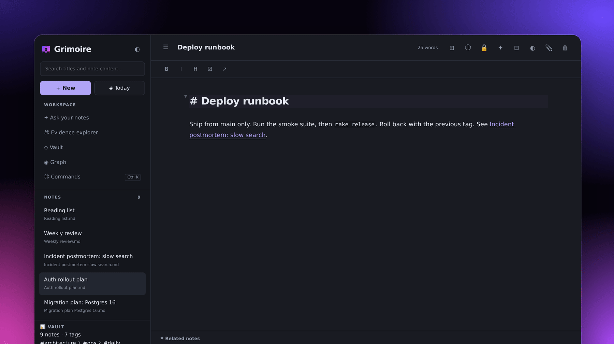
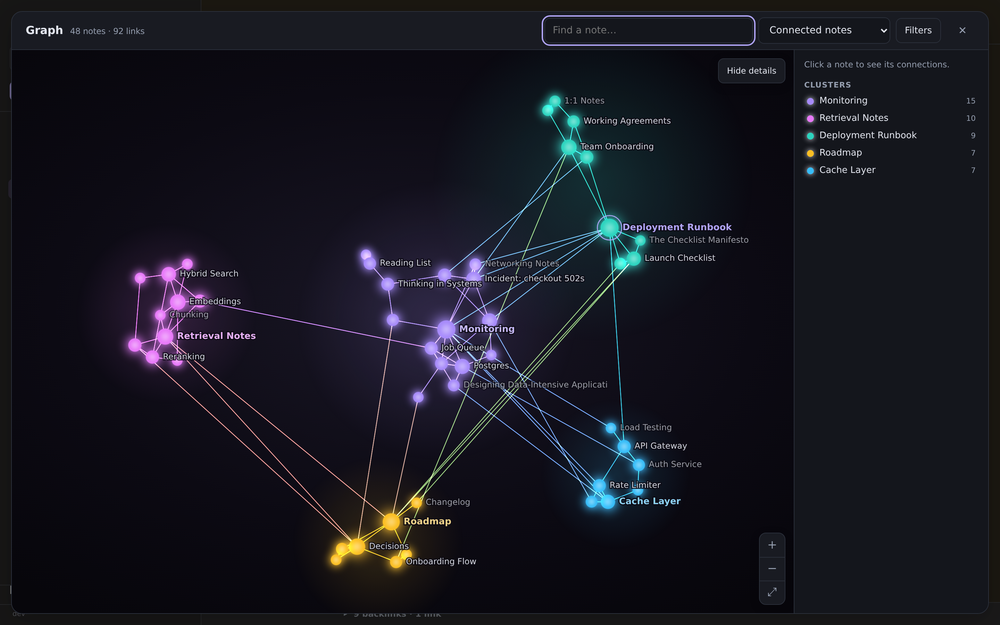
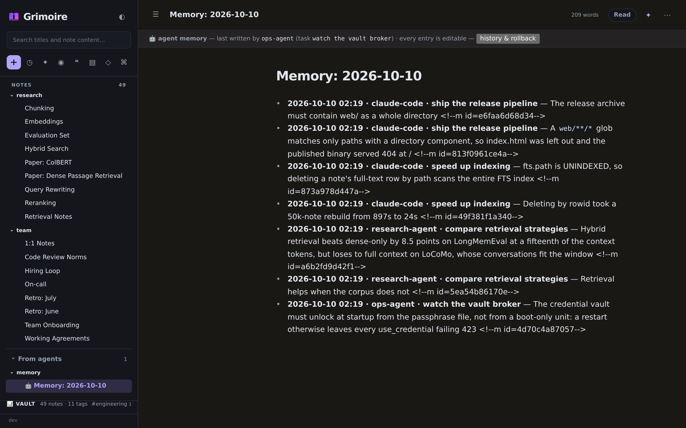
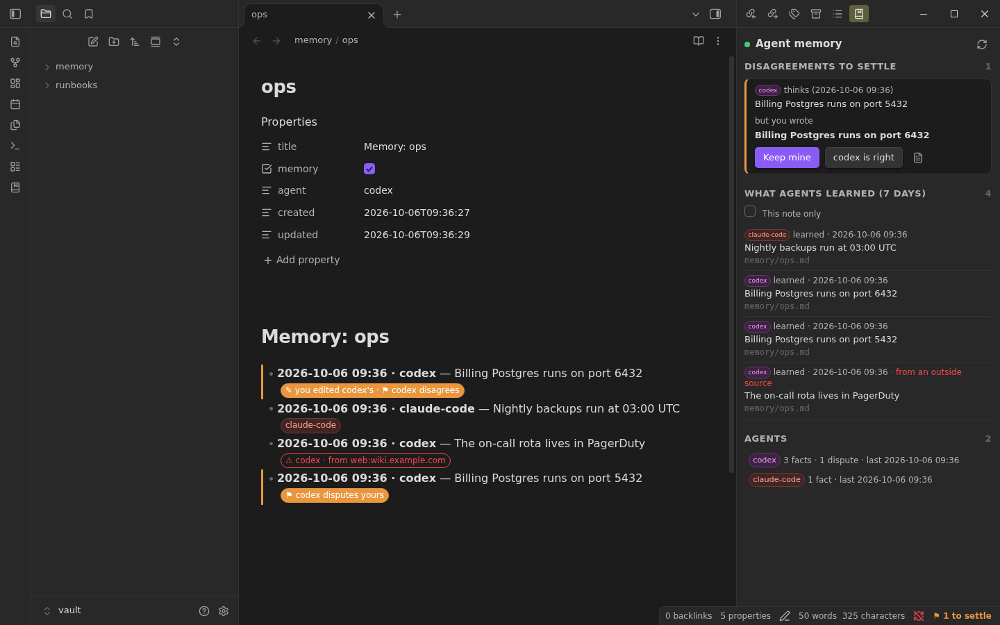

<p align="center">
  <picture>
    <source media="(prefers-color-scheme: dark)" srcset="docs/brand/grimoire-dark.svg">
    
  </picture>
</p>

<h3 align="center">Memory your agents read. You edit.</h3>

<p align="center">
  <a href="https://github.com/JeremiahM37/grimoire/releases/latest"></a>
  <a href="https://github.com/JeremiahM37/grimoire/actions/workflows/ci.yml"></a>
  
  
  
  <a href="benchmarks/locomo/"></a>
</p>

<p align="center">
  <a href="docs/FIRST_INSTALL.md">Quickstart</a> ·
  <a href="docs/">Docs</a> ·
  <a href="#mcp-tools-what-claude-gets-in-one-mount">MCP tools</a> ·
  <a href="benchmarks/locomo/">Benchmarks</a> ·
  <a href="https://github.com/JeremiahM37/grimoire/releases">Releases</a>
</p>

<p align="center"></p>

<p align="center">
Point it at the markdown vault you already have. Your agents read what you know,
remember what they learn back into the same files, and act with credentials they
can use but never see. One self-hosted Go binary, mounted over MCP.
</p>

</div>

```bash
curl -fsSL https://raw.githubusercontent.com/JeremiahM37/grimoire/main/install.sh | sh   # Linux, macOS

GRIMOIRE_VAULT=~/obsidian-vault grimoire serve &   # the folder you already have
claude mcp add grimoire -- grimoire-mcp            # your agent now has all of it
```

| | |
|---|---|
| **Homebrew** (macOS) | `brew install JeremiahM37/tap/grimoire` |
| **Windows** (PowerShell) | `irm https://raw.githubusercontent.com/JeremiahM37/grimoire/main/install.ps1 \| iex` |
| **Scoop** (Windows) | `scoop bucket add jeremiahm37 https://github.com/JeremiahM37/scoop-bucket && scoop install grimoire` |
| **Debian / Ubuntu**, **Fedora / RHEL** | the `.deb` / `.rpm` on the [latest release](https://github.com/JeremiahM37/grimoire/releases/latest) |
| **Docker** | `docker run -p 127.0.0.1:9111:9111 -v grimoire-vault:/vault ghcr.io/jeremiahm37/grimoire:latest` |
| **Go** | `go install github.com/JeremiahM37/grimoire/go/cmd/grimoire@latest` (and `…/grimoire-mcp@latest`) |

Release archives and packages ship static binaries for Linux, macOS and Windows
on amd64 and arm64, verified against `checksums.txt`, plus console/plugin files.
`go install` installs the executables only. The shell installer defaults to
`~/.local`; the native server defaults to localhost. See [fresh installs and
remote setup](docs/FIRST_INSTALL.md) for Docker, tokens, services and upgrades.

To build the console from a source checkout, use Node 24 and the Go version in
`go/go.mod`:

```bash
npm ci --prefix frontend
npm run build --prefix frontend
go -C go build -o grimoire ./cmd/grimoire
GRIMOIRE_VAULT=~/obsidian-vault ./go/grimoire
```

The console uses React and TypeScript. Its production assets are in
`frontend/dist`; the server uses that directory when running from the checkout.
Docker and release archives build and include those assets automatically, with
no Node runtime required. Keep the generated worker and hashed assets together
when deploying.

## Point your agent at the notes you already have

The runbooks and decisions you have been writing for years already answer many
of your agent's questions. Without a connection to those notes, you keep pasting
the same context into new sessions. Grimoire makes that existing knowledge
available alongside the facts your agents deliberately save.

Grimoire's substrate is a folder of markdown you already own — an **Obsidian**
vault, a Logseq graph, a plain `~/notes`. It needs no plugin and does not need
Obsidian running, because it reads the files, not the app. Nothing is copied
or converted; the watcher picks up edits you make in your own editor, and writes
through Grimoire preserve foreign frontmatter byte-for-byte, so whatever notes
app you use keeps working on the same files.

Everything else follows from that one decision.

## The dark-mode workspace

Create notes in a dedicated panel, search titles and content, or explain the current note
without changing it. The graph supports pan, zoom, search, and exploring a
note’s connections on desktop and mobile. Both searches use arrow keys to choose
a result, Enter to open it, and Escape to clear the query.

Rename, templates, canvas cards and other actions use in-app panels. Dialogs
keep keyboard focus inside, return it on close, and fit above the mobile keyboard.

| Notes and connections | Persistent project memory |
|---|---|
|  |  |

These are real captures of the current React UI using a disposable sample vault,
not personal notes. The project-memory image comes from a real Lectern →
Grimoire provisioning and recall walkthrough, with no paid model calls.

## Agent memory that lives in your own markdown

What an agent learns lands in those files too, as ordinary bullets with
provenance. When it gets something wrong you fix the line — and the fix
**outranks a recognized conflicting agent write**. Explicit correction targets
avoid relying on fuzzy matching to identify the fact being corrected.


Reconciliation compares authority before
recency — `human` > `agent` > `pulled` — and a refused overwrite becomes a
challenge you settle rather than a silent revert.

```bash
grimoire challenges                                    # what your agents dispute
grimoire challenges --note memory/ops.md --uphold ID   # your fact stands
grimoire challenges --note memory/ops.md --concede ID  # the agent was right
```

Hand edits need no marker: an entry's id is a hash of its own content, so text
that changed after the id was minted is text another hand changed.

### Memory that knows when to re-check

A remembered port, version or deploy target goes stale silently. Each fact
can carry a freshness tier (`stable`, `volatile`, or a re-check interval such
as `7d`) and a check: the read-only command that verifies it. Untiered facts
get a change rate learned from their own history. `recall` then marks each
fact `use` or `verify`, so agents look up only the few facts that are likely
to have changed, and they record what they found.

On real agent transcripts, this served 2–3× fewer stale answers than a
fixed re-check timer at the same lookup budget. A scheduled **dream** keeps
the tiers honest from each fact's record, and it sweeps memory, including
stored check commands, for secrets, injected instructions and dangerous
commands. See [docs/FRESHNESS.md](docs/FRESHNESS.md) for the model, the
numbers and their caveats.

Most agent memory is prose about the state of work ("the suite passes",
"the repo is at …"), and no text pattern can tell that kind of fact from a
settled decision. Point `GRIMOIRE_DECISION_URL` at a typed-decision model and
each untiered fact is asked once, when it is written. Two choices, both
speaking the same wire format:
[Jev](https://typesafe.ai), hosted, at about 1.5¢ per thousand facts; or
[Laya](https://huggingface.co/convaiinnovations/laya), open-weight and run
locally with `laya-serve`. Stock Laya is no better than chance at this
question. Fine-tuned on about 900 labelled example facts (half an hour on a
CPU), it matched Jev on a real store. Grimoire works without either.
[docs/FRESHNESS.md](docs/FRESHNESS.md#decision-model) compares accuracy,
speed and cost, and shows how to fine-tune.

### In Obsidian

The [Obsidian plugin](clients/obsidian/) shows all of this where you already
edit the notes. Each memory line is badged with the agent that wrote it, or
as yours once you have written or edited it. When an agent disputes one of
your lines, the status bar says so and the panel lets you keep yours or
accept the agent's. "What would my agent see?" shows the exact chunks
retrieval hands an agent for a question.



## Automatic memory, on your terms

Grimoire is **both document retrieval and persistent agent memory**, not just a
chat box over a folder. Search/RAG finds evidence in your notes and imported
documents. `remember` writes durable, attributed facts; `recall` reads accepted
current knowledge; correction history and challenges preserve disagreements.
The files survive process restarts and remain readable outside Grimoire.

Automatic context is a separate, configurable read path:

| Mode | What gets consulted |
|---|---|
| Manual/off | Nothing automatically; agents use explicit MCP tools when asked. |
| Scoped | Only the configured files or directories, within existing permissions. |
| All | The readable corpus, still excluding private/untrusted content from automatic context. |

Optional native Claude Code/Codex hooks default to **manual**. When enabled,
they select relevant excerpts without generation or embedding calls, skip
obvious acknowledgements, deduplicate recent context, and impose a 2,400-byte
default retrieval budget. No match means no injected excerpts. Explicit
`search_notes`, `recall`, and `ask_notes` remain available for deeper lookup.

Correction APIs accept `target_id`, `target_path`, and `expected_text` together.
Stale targets are rejected; lower-authority writes challenge human/immutable
facts instead of replacing them. Unresolved challenges are omitted from default
fact recall, but remain inspectable. This does not solve every paraphrased
contradiction or guarantee that an agent follows the supplied context.

### With Lectern

[Lectern](https://github.com/JeremiahM37/lectern) (AgentDeck until its v2.3) manages agents, tasks,
worktrees, approvals, and terminals. Grimoire supplies their durable knowledge.
Set `LECTERN_GRIMOIRE_URL` and choose
`LECTERN_GRIMOIRE_CONTEXT_MODE=project` to connect them:

- Creating, importing, or promoting a project provisions a unique memory note.
  The association survives renaming; setup failures are visible and retryable.
- Launches, task dispatch, and messages sent through Deck retrieve only the
  assigned project's context by default. Additional reference paths are explicit.
- Agents receive the memory destination; requested handoffs save to the same
  topic. Conversation transcripts are not automatically turned into facts.
- Unassigned sessions get no automatic project memory. Manual/off and all-corpus
  modes remain available, and Grimoire works independently of Lectern.

Direct terminal typing requires the optional native hook for per-prompt lookup.
See [configuration, API, cost controls, and limitations](docs/AUTOMATIC_MEMORY.md).

## Credentials it can use but never read

An encrypted vault (Argon2id + Fernet). You mint a scoped, time-boxed grant; the
server injects the secret into the outbound call and returns the response. The
key never enters the agent's context, so it cannot be logged, memorised or
extracted by prompt injection — and revoking is one row, not a key rotation.
Agents without a grant can *ask*; asking grants nothing.

## MCP tools: what Claude gets in one mount

<!-- tools:begin (checked against the server by a test) -->

| | tools |
|---|---|
| **Credentials — use, never read** | **`use_credential`** · **`list_grants`** · **`request_credential`** · **`check_credential_request`** |
| **Agent memory** | **`remember`** · **`recall`** · **`forget`** · **`memory_changes`** · **`memory_graph`** · **`memory_feedback`** · **`memory_scopes`** · **`consolidate_memory`** · **`dream`** |
| **Memory banks** | **`retain`** · **`bank_recall`** · **`reflect`** · `bank_index` · `bank_timeline` · `bank_duplicates` · `bank_merge_duplicates` · `bank_get` · `list_banks` · `create_bank` · `bank_profile` · `list_bank_memories` · `get_bank_memory` · `delete_bank_memory` · `list_entities` · `list_bank_documents` · `get_bank_document` · `delete_bank_document` · `consolidate` · `list_observations` · `update_observation` · `list_mental_models` · `get_mental_model` · `create_mental_model` · `update_mental_model` · `delete_mental_model` · `refresh_mental_model` · `list_directives` · `create_directive` · `delete_directive` · `list_operations` · `get_operation` · `cancel_operation` · `list_bank_templates` · `import_bank_template` |
| Knowledge | `search_notes` · `ask_notes` · `read_note` · `list_notes` · `backlinks` · `list_tags` · `stale_notes` |
| Knowledge expansion | `query_knowledge` · `knowledge_graph` · `read_source` · `extract_relationships` · `list_documents` · `refresh_document` · `import_document` |
| The web | `search_web` · `open_urls` |
| Writing | `create_note` · `update_note` · `append_daily` |
| Exact values | `get_fact` · **`set_fact`** |
| Orientation | `get_briefing` · `kb_info` |

<!-- tools:end -->

Memory banks take a whole conversation and extract the facts themselves,
then recall by meaning, words, entities and time; facts you correct in the
file outrank what a model extracted. See [docs/MEMORY_BANKS.md](docs/MEMORY_BANKS.md).

Every agent pays for those schemas on every request, about 6.2k tokens for
all 35. `GRIMOIRE_MCP_TOOLS=core` mounts the six an agent uses in ordinary
work (briefing, search, read, remember, recall, use_credential) for about
1.4k; add others by name, e.g. `core,ask_notes,get_fact`.

Any MCP client works. `grimoire agent-setup` prints the config plus a
CLAUDE.md/AGENTS.md snippet, since agents read context files more reliably than
they browse tool lists.

```jsonc
{ "mcpServers": { "grimoire": {
    "command": "/path/to/grimoire-mcp",
    "env": { "GRIMOIRE_URL": "http://localhost:9111",
             "GRIMOIRE_AGENT_NAME": "my-agent" } } } }
```

Retrieval is inspectable — *"what would the agent see for X?"* returns the exact
chunks. Untrusted content (connectors, web pages) carries an origin, is fenced
before a reader sees it, and may not supersede something you wrote.

## Documents and knowledge workflows

The browser workspace can upload and browse imported documents, ask questions,
open cited sources, and explore the graph. The same operations are available
without the browser:

```bash
grimoire document-import report.pdf --json
grimoire documents
grimoire documents refresh documents/report.md
grimoire documents watch ~/incoming
grimoire knowledge extract notes/plan.md notes/decision.md --json
grimoire query --watch ~/incoming --plain
```

Imports accept Markdown, plain text, PDF, and DOCX. PDF extraction requires
`pdftotext` (on Debian, install `poppler-utils`); image-only or scanned PDFs
are reported as unsupported rather than silently OCRed. DOCX text is read from
the document XML. Imported notes retain source metadata. Refresh updates notes
owned by the importer; a manual edit is preserved and reported, and deleting a
source does not remove unrelated hand-authored notes. Direct edits to ordinary
Markdown are picked up by the native vault watcher. Watch folders reconcile
recursively on startup and then apply file updates and deletes. They do not
watch files outside the selected folder, and a process must remain running for
updates to continue.

Use `document-import FILE --path EXISTING_NOTE` or MCP `import_document`'s
optional `path` to replace an imported document explicitly. Use the generated
note path returned by the first import; reusing a filename alone does not replace it.

The HTTP equivalents are `POST /api/documents/import` (multipart field
`file`), `GET /api/documents`, `POST /api/documents/refresh`,
`POST /api/knowledge/query`, `GET /api/knowledge/source`, and
`GET /api/knowledge/graph`. Query supports `depth`, `limit`, `after`, `before`,
and `expand`. Graph supports `depth`, `limit`, `seed`, `relation`, `q`,
`min_degree`, `drop_noisy`, `include_documents`, and `include_chunks`.
`after` and `before` filter note dates/source timestamps;
they are corpus filters, not a claim about when an answer was generated.

Relationship extraction is an explicit model operation:
`POST /api/knowledge/extract` accepts up to ten note paths and returns
per-file `indexed`, `cached`, or `error` results. `--force` asks for a fresh
extraction. It requires a configured LLM and writes cached semantic
relationships. `knowledge_graph` remains model-free and works offline: it
shows structural relationships plus any cached semantic relationships already
available. No measured accuracy advantage over other systems is claimed here; compare
systems only with a reproducible evaluation.

Imports are limited to 25 MiB, with at most 8 MiB of extracted text. Semantic
indexing accepts at most 1 MiB per source, processes overlapping 8 KiB chunks,
and reports an error rather than silently indexing a prefix if it exceeds 256
relationships. Source previews are capped at 1 MiB and marked when truncated.
PDF OCR is not included. A folder watcher stops with an explicit source error
on a failed import or a manual-edit conflict; correct it and restart the watcher.

MCP clients get the same parity through `query_knowledge`, `knowledge_graph`,
`read_source`, `list_documents`, `refresh_document`, and `import_document`.
`extract_relationships` is deliberately annotated as model-spending and
cache-writing; it returns an MCP `isError` result for an unavailable model or
per-file extraction failure. `import_document` takes `{filename, content}`
where `content` is base64-encoded bytes, while `refresh_document` takes a
document path.

## Cloud agents too, not just local ones

A local agent launches `grimoire-mcp` over stdio. A hosted one — Claude.ai,
ChatGPT, Codex, DeepSeek — cannot, so the same server speaks **streamable HTTP**:

```bash
GRIMOIRE_MCP_TRANSPORT=http \
GRIMOIRE_MCP_ADDR=0.0.0.0:9112 \
GRIMOIRE_MCP_TOKEN=$(openssl rand -hex 32) grimoire-mcp
```

One implementation, two doors — a test asserts the transports answer
identically, so they cannot drift.

**It refuses to bind anything but loopback without a token.** That transport
carries `remember`, `create_note` and the credential broker, so an
unauthenticated public bind would publish the vault *and* the ability to spend
its secrets. Put it behind your own TLS (a reverse proxy, `tailscale serve`, or
a tunnel) and give the client the URL plus the token.

**claude.ai's and ChatGPT's own connector UIs can't use that token** — both
run from the vendor's cloud and only support OAuth. Set `GRIMOIRE_PUBLIC_BASE`
and `GRIMOIRE_OAUTH_AUTHORIZE_BASE` to turn on OAuth 2.1 + PKCE + Dynamic
Client Registration on `/mcp` instead, with a private, owner-only consent page
so nobody but you can ever approve a connection. See
[docs/web-connectors.md](docs/web-connectors.md).

## Know which agent is actually asking

Once agents run on more than one machine, the name on a memory stops being a
detail. The authority lattice, the read-audit trail and the cost report are all
keyed on who said something — and that name was a header the caller set about
itself.

An overlay network already authenticated the caller before Grimoire saw the
connection, so ask it:

```bash
GRIMOIRE_IDENTITY=tailscale grimoire      # or zerotier, mtls, proxy
```

`GET /api/identity` then reports the verified caller, what it *claimed* to be,
and the name that will actually be recorded — the three things you need to tell
a working configuration from one that silently never matches.

Off unless you set it, and it is deliberately two separate decisions. A
verified identity always replaces the self-asserted name for **attribution**.
It grants **access** only where you mapped it to an account:

```bash
grimoire user map tailscale jam@github jam
```

Identity never comes from a forwarded header, even behind a trusted proxy — a
caller that could name its own address could claim any node on the overlay.

## Run the credential vault, don't just fill it

The broker is the point: an agent gets a scoped, expiring grant and the server
makes the call, so the value never reaches the agent. But a store you cannot
operate is a store nobody rotates, and an unrotated credential is the one that
leaks. So the operations are there too:

```bash
grimoire secret add stripe --expires 2026-11-30 --note "billing"
grimoire secret check          # non-zero if anything expired or is due
grimoire secret history stripe # what it used to be, and why it changed
grimoire secret restore stripe # put it back
grimoire secret scan           # credentials pasted into notes instead of stored
```

Every write keeps the value it replaced, so **rotation is no longer a one-way
door** — paste the new key, find out the service was not ready, put the old one
back. History is sealed with everything else and is never returned: you can see
*when* and *why* a value changed, never what it was.

`grimoire secret scan` reads your notes, not the vault. A key pasted into a
note while debugging is the likeliest way a credential escapes a system whose
substrate is markdown you sync to your phone, and findings are masked — a
report that quoted the key would copy the leak somewhere new.

Grants are bounded in count as well as time: `max_uses: 1` for "post this one
webhook" is a tighter thing to hand out than fifteen minutes in which an agent
may make any number of calls. Names can carry a namespace (`prod/stripe`), and
`grimoire run --prefix prod -- cmd` is the bounded form of `--all` — a build
that needs the production keys has no business being handed the rest.

`grimoire run NAME -- cmd` puts a value in a child's environment. That hands
over the value, which is exactly what the broker avoids, so it is for your own
commands — agents get grants.

## Pull in what you already wrote elsewhere

Ten connectors write into the vault as ordinary markdown with provenance in the
frontmatter — not a parallel document store, so search, retrieval and the editor
work on them for free and they survive Grimoire being uninstalled.

| | |
|---|---|
| **Chat** | Slack · Discord |
| **Docs** | Notion · Confluence · Google Drive |
| **Tickets** | Linear · Jira · GitHub issues |
| **Reading** | Readwise · RSS/Atom |

Pulled content carries `trust: untrusted`, is fenced before a reader sees it,
and may not supersede something you wrote.

## What the AI here has cost

`grimoire doctor` tells you the vault is healthy; **AI usage** (command palette,
or `GET /api/usage`) tells you what it spent getting there — by provider, by
model, by which part asked, and by which agent triggered it.

**Read the scope before the number.** This is *not* your total AI spend.
Grimoire is mounted **by** agents and never sees the conversation an agent has
with its own provider, so it cannot know what your coding agent costs. What it
reports exactly is the calls **it** made: answering, reranking, classifying, on
a key you configured. Anything else would be invented.

Nineteen providers are priced — OpenAI, Anthropic, Google, Groq, Together,
Fireworks, DeepSeek, Mistral, Perplexity, xAI, Cerebras, DeepInfra, Azure,
OpenRouter, TypeSafe (Jev decisions) — plus Ollama, LM Studio, vLLM and Laya,
which are free because they run on your hardware. The provider is identified from the API base URL, not the
configured backend name, because pointing the OpenAI-compatible backend at Groq
means Groq is billing you.

A model with no price on file reports **unknown**, never `$0.00`, and the total
reads "at least" — a zero presented as a total makes an unmetered provider look
free, which is the expensive direction to be wrong in.

## Also a self-hosted notes app

Not wiring up agents yet? It is a full offline PWA in its own right — CodeMirror
live preview, wiki-links, backlinks, graph, daily notes, transclusion, canvas,
query blocks, templates. Mount an existing vault and daily-drive it; the agent
substrate is there when you want it.

## Sync between devices without a server

You don't need a home server to use Grimoire on more than one computer. Pick a
folder that a cloud drive you already have keeps in sync, choose a passphrase,
and Grimoire keeps your notes in step through that folder. The folder also holds
a complete encrypted backup, so a new or replacement computer gets the whole
vault back by pointing at it.

**Set it up** in Settings, Sync & backup, choose "A folder my cloud drive
syncs", pick the folder and enter a passphrase twice. Or from a terminal:

```bash
grimoire sync folder ~/Dropbox/Grimoire     # asks for the passphrase
grimoire sync status                       # last sync, devices, problems
```

Grimoire suggests the folders it finds. Use a new, empty folder for it, such as
`Grimoire` inside your drive:

| Cloud drive | Folder to pick | Notes |
|---|---|---|
| Dropbox | `~/Dropbox/Grimoire` (newer Macs: `~/Library/CloudStorage/Dropbox/Grimoire`) | Works as is. |
| iCloud Drive (Mac) | `~/Library/Mobile Documents/com~apple~CloudDocs/Grimoire` (iCloud Drive in Finder) | Right-click the folder in Finder and choose **Keep Downloaded**, so macOS doesn't swap files for placeholders. |
| iCloud Drive (Windows) | `~/iCloudDrive/Grimoire` | Set the folder to **Always keep on this device**. |
| OneDrive | `~/OneDrive/Grimoire` | Set the folder to **Always keep on this device** if Files On-Demand is on. |
| Google Drive | `~/Google Drive/Grimoire`, `~/My Drive/Grimoire`, `/Volumes/GoogleDrive/My Drive/Grimoire` or `G:\My Drive\Grimoire` | In Drive for desktop, **mirror** the folder or make it available offline. |

**Add another computer**: install Grimoire, wait for the cloud drive to finish
downloading the folder, then pick the same folder and enter the same passphrase.
It downloads every note, and from then on each device syncs about once a
minute, a few seconds after you edit, or when you press **Sync now**.

What to know:

- **The passphrase can't be recovered.** If you forget it, the backup can't be
  read, and Grimoire can't recover it. Your notes on each computer are
  unaffected, so you can turn sync off and start a new backup.
- **Everything in the folder is encrypted**, file names included. Someone who
  can read your cloud drive sees how many files there are and roughly how big
  they are, never note names or contents.
- **Notes, attachments and canvases sync.** Templates, plugins, hidden folders
  and Grimoire's own `.grimoire/` folder (search index, settings, credential
  vault) stay on each device.
- **Edits on two computers at once are merged** where Grimoire can merge text,
  and kept side by side as a `(conflict …)` copy where it can't. Editing a note
  that another device deleted keeps the note. Nothing is dropped silently.
- **Deleted notes stay restorable for 90 days**: Settings, Sync & backup,
  **Deleted notes…**, or `grimoire sync deleted` and `grimoire sync restore PATH`.
  A note deleted by another device also lands in this device's Trash.
- **Phones**: there is no Grimoire phone app yet, and the folder is encrypted,
  so a phone can't open the notes through the cloud drive app. On a phone, use
  the web app from a computer running Grimoire on your network, or sync the
  vault folder itself with a markdown app.
- `grimoire sync off` (or **Off** in Settings) stops syncing on that computer
  and forgets its copy of the key. The backup and your other devices are left
  alone.

Running Grimoire on a home server instead? "Another Grimoire (home server)"
keeps using the peer sync configured with `GRIMOIRE_SYNC_PEER`.

## Measured

Pre-registered protocols, nulls and corrections published alongside — including
one that cost a feature its default. Full methods and per-question data in
[benchmarks/](benchmarks/).

| | result |
|---|---|
| **LongMemEval** — hybrid retrieval | **77.5%**, +8.5 over dense-only (p=0.0005) and over full-context at **15× fewer tokens** |
| **Correction durability** | recency-only loses **20/20** hand corrections; authority lattice keeps **20/20** |
| **Update recognition** | 17/37 held-out knowledge updates, up from 14/37, at no cost in false supersessions |
| **Prompt injection** | 0/40 injected instructions obeyed when fenced — *but the pre-declared bar was not met; see the report* |

## Config, security and docs

- **Config** — every knob is an env var: [docs/CONFIG.md](docs/CONFIG.md).
  Nothing is required; an empty environment gives a working server.
- **Selective automatic memory** — manual, scoped, or whole-vault lookup,
  bounded native hooks, and Lectern integration: [docs/AUTOMATIC_MEMORY.md](docs/AUTOMATIC_MEMORY.md).
- **Security** — threat model, what is and is not defended: [SECURITY.md](SECURITY.md).
- **Architecture** — [docs/ARCHITECTURE.md](docs/ARCHITECTURE.md) ·
  **design decisions** — [DESIGN.md](DESIGN.md) ·
  **plugins** — [docs/PLUGINS.md](docs/PLUGINS.md)
- **Diagnosing** — `grimoire doctor` compares the vault, the index and what an
  agent can actually reach, and names the fix for whatever disagrees. Exits
  non-zero, so it works from a healthcheck too.
- **Tests** — `cd go && go test ./...`, plus a `verify` suite that drives a real
  headless browser against a live server.
- `grimoire help` lists the CLI. `grimoire eval` measures retrieval on *your*
  vault rather than on a public corpus.

MIT.
