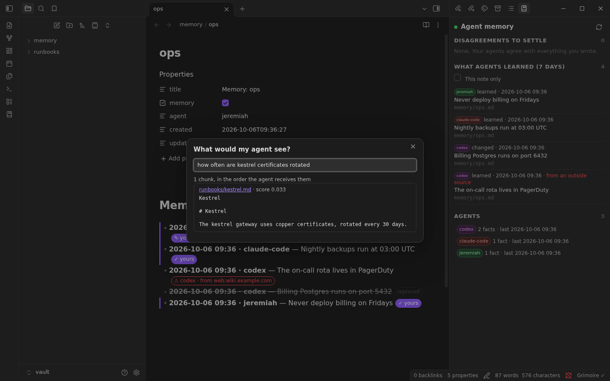

# Grimoire for Obsidian

See what your agents remember, in the vault you already use.

Grimoire stores agent memory as ordinary markdown bullets in your vault. This
plugin makes them readable and puts you in charge of them:

- **Who wrote each line.** Every memory line gets a badge: the agent that wrote
  it, or *yours* once you have written or edited it. The `<!--m … -->`
  metadata folds into the badge; put the cursor on the line to edit it raw.
- **Your edit wins.** Fix a line an agent got wrong and it becomes yours. An
  agent can dispute it later but not overwrite it.
- **Disputes to settle.** When an agent disagrees with something you wrote,
  the status bar shows it, both lines are marked, and the panel offers
  **Keep mine** or **Agent is right**. Either way the file keeps the record.
- **What would my agent see?** Type a question and get the exact chunks
  retrieval hands an agent, in order. Tells "it never saw the note" apart from
  "it saw the note and ignored it".
- **Tell my agents.** Save a fact as yours, so agents can dispute it but not
  replace it. **Make this memory line mine** does the same for a line an agent
  wrote that you agree with.
- **Outside sources flagged.** A fact an agent copied from the web or a
  connector is marked, since it cannot override what you wrote.
- Recent agent activity, per-agent counts, light and dark themes, mobile.




## Install

You need a running [Grimoire](../../README.md) serving the same folder as your
vault (or a folder inside it).

```bash
git clone https://github.com/JeremiahM37/grimoire
grimoire/clients/obsidian/install.sh ~/path/to/your/vault
```

Then enable **Grimoire Agent Memory** under Settings → Community plugins, and
set the server URL (default `http://127.0.0.1:9111`) and a token if your server
requires one. If Grimoire serves a subfolder of the vault, set
**Grimoire folder** to it.

The badges work offline: they read the file. The panel, disputes and
retrieval need the server.

## Develop

```bash
npm ci
npm run dev        # rebuild main.js on change
npm run typecheck
npm test           # unit tests, plus integration tests against a real server
```

The integration tests need the server built first
(`go -C ../../go build -o grimoire ./cmd/grimoire`).

`test/fixtures/memory-lines.json` is written by the Go parser
(`go test ./internal/memory -run TestObsidianGolden -update-golden`) and read
by the plugin's tests, so the plugin cannot drift from how the server decides
whose line is whose.

`e2e/run_obsidian_e2e.py` drives the plugin inside a real Obsidian against a
real server in throwaway directories, end to end: badges, an edit in the
editor, a dispute, settling it from the panel, and the commands. It needs Xvfb
and Python Playwright:

```bash
OBSIDIAN_BIN=/path/to/obsidian-1.x/obsidian python e2e/run_obsidian_e2e.py
```
